## მონაცემთა მომზადება

მონაცემთა ბაზა შეგიძლიათ იხილოთ შემდეგ
მისამართზე: https://tcga-xena-hub.s3.us-east-1.amazonaws.com/download/TCGA.BRCA.sampleMap%2FHiSeqV2.gz

მონაცემები ჩატვირთულია Jupyter Notebook-ში, და ქვემოთ ნაჩვენებია მისი ვიზუალიზაცია.

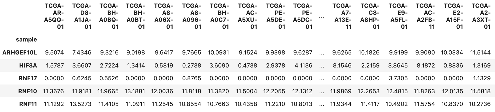

როგორც შეინიშნება, ბაზა შეიცავს მონაცემებს, რომლებიც ანალიზისთვის გამოუსადეგარია, ამიტომ პირველ რიგში გავფილტრეთ
მონაცემები. ყველა ნულოვანი მნიშვნელობა გადავაქციეთ NaN-ად და ყველა სტრიქონი, რომელიც შეიცავდა NaN-ს, ამოვშალეთ. შედეგად,
სტრიქონების რაოდენობა 20530-დან 12657-მდე შემცირდა.

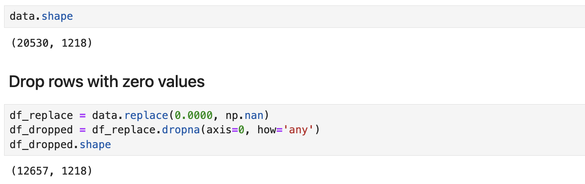

ამის შემდეგ, მონაცემები გავყავით ორ DataFrame-ად: ერთში კიბოს უჯრედების გენების ექსპრესიის მნიშვნელობები და მეორეში
ნორმალური უჯრედების გენების ექსპრესიის მნიშვნელობები. ნიმუშები, რომლებიც მთავრდება 11-ით, მიუთითებდნენ ჯანმრთელ
უჯრედებზე, ხოლო 01-ით დამთავრებულები — კიბოთი დაავადებულ უჯრედებზე.

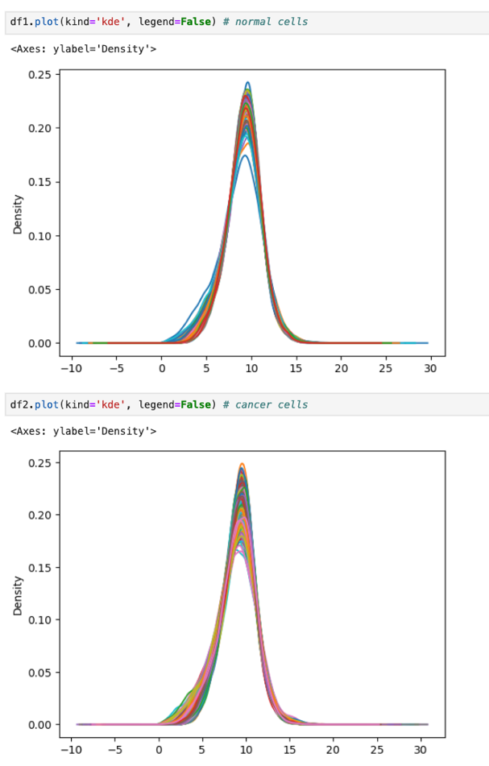

KDE plot-ებით თვალსაჩინოა, ორივე DataFrame-ში მონაცემები ნორმალურად არის განაწილებული.

## Differential Expression Analysis

DEG ანალიზი წარმოადგენს მეთოდს, რომელიც გამოიყენება გენებისა და სხვა ბიოლოგიური მოლეკულების ექსპრესიის განსხვავებების
შესასწავლად სხვადასხვა პირობებში (მაგალითად, ნორმალურ და დაავადებულ უჯრედებში). `Limma` არის ერთ-ერთი პოპულარული პაკეტი,
რომელიც ფართოდ გამოიყენება ამ ტიპის ანალიზისთვის. `Limma` თულის გამოყენების შემდეგ შესაძლებელია მნიშვნელოვანი
განსხვავებით გამოხატული გენების იდენტიფიცირება *(Differentially Expressed Genes)*, რომელთა ბიოლოგიური მნიშვნელობაცაა
დაავადების სპეციფიკური მარკერების იდენტიფიცირება ან ახალი თერაპიული მიზნების აღმოჩენა.

`R`-ის `limma` package გამოვიყენეთ Python-ში `rpy2` ბიბლიოთეკის მეშვეობით.

* პირველ რიგში, შევქმენით გაერთიანებული DataFrame (df1 და df2) და ჯგუფის ლეიბლები, რომლებიც აღწერს თითოეული სვეტის
  მდგომარეობას (ნორმალური ან კიბო). ვინაიდან მონაცემები წინასწარ დამუშავდა (ნორმალიზებულია და დაბალი გამოხატვის გენები
  ამოშლილია), ისინი მზადაა Limma-ს შემდგომი ანალიზისთვის. შემდეგი ეტაპებია:

1. **დიზაინ მატრიცის შექმნა**: გათვალისწინებული პირობების (მაგალითად, ნორმალური და დაავადებული უჯრედები) შესაბამისი
   დიზაინ მატრიცის შექმნა, რომელიც მოიცავს ჯგუფების ლეიბლებს.

2. **კონტრასტ მატრიცის შექმნა**: ქმნის კონტრასტ მატრიცას, რომელიც გამოიყენება კიბოსა და ნორმალური გენების გამოხატვის
   შედარებისთვის.

3. **ევალუაცია**: მეთოდი იყენებს სტატისტიკურ ტესტებს გენის გამოხატვის დონეების შესადარებლად სხვადასხვა პირობებში;
   მნიშვნელოვანი განსხვავებით გამოხატული გენების სიების შექმნა.

### Top 100 DEGs

აღნიშნული ანალიზით მიღებული შედეგები დავალაგეთ adjusted P value მიხედვით და ამოვიღეთ პირველი **N=100** მათგანი.

N პირობითად 100-ად იმიტომ ავირჩიეთ, რომ მომდევნო ეტაპზე ანალიზისთვის საკმარისი ყოფილიყო, თუმცა ამავდროულად გამოთვლითი
კომპლექსურობა არ გამოეწვია და გრაფებით ვიზუალიზაციისთვისაც მარტივი ყოფილიყო.

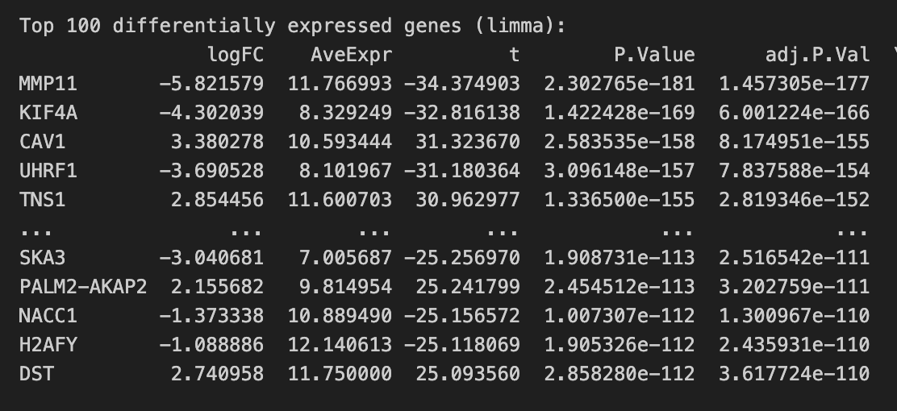

## Correlation Analysis

დიფერენციული ექსპრესიის ანალიზის შემდეგ, განხორციელდა კორელაციის ანალიზი ნორმალური და სიმსივნური მონაცემებისთვის.
ძირითადი ნაბიჯები:

1. **მონაცემთა ტრანსპონირება და კორელაციის მატრიცის გამოთვლა**:

```
df1_t = df1.loc[diff_exp.index].T
correlations1 = df1_t.corr()
correlations1.head()
````

- **df1**: ნორმალური (არასიმსივნური) მონაცემების DataFrame.
- **diff_exp**: ტოპ 100 დიფერენციულად ექსპრესირებული გენი.
- **correlations1**: ნორმალური მონაცემების კორელაციის მატრიცა.

იგივე პროცესი განხორციელდა სიმსივნური მონაცემებისთვის:

2. **Adjacency მატრიცის შექმნა**:

```
THRESHOLD = 0.8
adj1 = correlations1.copy()

np.fill_diagonal(adj1.values, 0)
adj1[adj1.abs() < THRESHOLD] = 0
adj1.head()
```

- **THRESHOLD**: კორელაციის ზღვარი, რომელიც განსაზღვრავს, რომელი კავშირები დარჩება მატრიცაში.

იგივე პროცესი განხორციელდა სიმსივნური მონაცემებისთვის (df2).

## Coexpression Networks

Adjacency მატრიცით უკვე შეგვიძლია გრაფების აგება ე.წ. **Coexpression Network**-ების ანალიზისთვის.

**კოექსპრესიის ქსელის ანალიზი** წარმოადგენს ბიოინფორმატიკის მნიშვნელოვან მეთოდს, რომელიც გამოიყენება გენების
ურთიერთქმედების და მათი რეგულაციის მექანიზმების შესასწავლად.

ამ ანალიზის მეშვეობით, შესაძლებელია გენების ექსპრესიის მონაცემების საფუძველზე გენების კავშირების ქსელის აგება, სადაც
კვანძები (nodes) გენებს წარმოადგენს, ხოლო წიბოები (edges) - გენების ექსპრესიის კორელაციას.

კოექსპრესიის ქსელები საშუალებას გვაძლევს, გამოვავლინოთ გენების ჯგუფები, რომლებიც ერთობლივად რეგულირდება და ფუნქციურად
დაკავშირებულია. ეს ინფორმაცია მნიშვნელოვანია ბიოლოგიური პროცესების, დაავადებების მექანიზმების და პოტენციური
ბიომარკერების იდენტიფიკაციისთვის.

* **გრაფების შექმნა**:

გრაფების ასაგებად გამოვიყენეთ პითონის `networkx` ბიბლიოთეკა.

```
import networkx as nx

# Create a graph from the adjacency matrix
G1 = nx.from_pandas_adjacency(adj1)
G2 = nx.from_pandas_adjacency(adj2)
```

- **G1**: ნორმალური მონაცემების გრაფი.
- **G2**: სიმსივნური მონაცემების გრაფი.

* **ვიზუალიცია:**


1. ჯანმრთელი

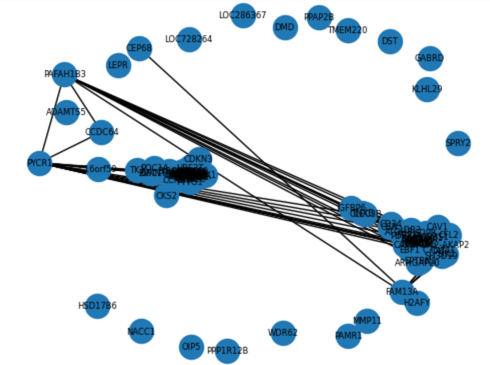

    ბმული კომპონენტების რაოდენობა: 20
    გაცალკევებული გენების რაოდენობა: 18

2. სიმსივნური

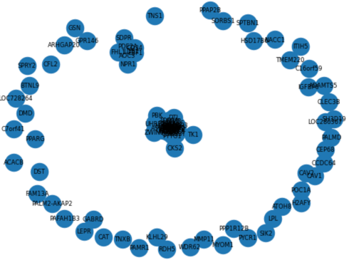

ბმული კომპონენტების რაოდენობა: 52
გაცალკევებული გენების რაოდენობა: 49

**ინტერპრეტაცია**:

მიღებული შედეგები დამოკიდებულია `THRESHOLD` პარამეტრის შერჩევაზე. როგორც მოვიძიეთ, coexpression ანალიზისთვის
სტანდარტულია 0.7-0.8 შუალედში შერჩევა, ჩვენ შემთხვევაში პირობითად ავიღეთ 0.8.

როგორც ვხედავთ, სიმსივნურ გრაფში მივიღეთ ბევრად მეტი ცალკეული ბმული კომპონენტი, ასევე მეტი outlier, ისეთი გენი, რომელიც
არც ერთ სხვასთან არ არის მნიშვნელოვან კორელაციაში. ჯანმრთელი გრაფის უფრო "შეკავშირებული" ხასიათი შეიძლება მეტყველებდეს
გენების ექსპრესიის უფრო მაღალ კოორდინაციასა და სტაბილურ ბიოლოგიურ პროცესებზე, რაც სიმსივნის დროს დარღვეულია.

## Identifying Hub Genes

ჰაბ გენები არის გენები, რომლებიც ქსელში მრავალ სხვა გენთან არის დაკავშირებული და მნიშვნელოვან როლს ასრულებს ბიოლოგიური
პროცესების რეგულაციაში. მათი იდენტიფიცირება მნიშვნელოვანია, რადგან ჰაბ გენები ხშირად წარმოადგენენ საკვანძო რეგულატორებს
და მოლეკულურ მექანიზმებს, რომლებიც გავლენას ახდენენ უჯრედის ფუნქციონირებაზე და დაავადებების განვითარებაზე.

### Hub Genes საპოვნელად, ორივე გრაფისთვის:

1. გამოვთვალეთ ყველა კვანძისთვის degree - გამომავალი წიბოების რაოდენობა
2. დავალაგეთ ამ სიდიდის მიხედვით და ამოვიღეთ 10 ყველაზე მაღალი.

### შედეგები:

1. ჯანმრთელისთვის:

   `Top Hub Genes: ['FOXM1', 'RRM2', 'ASF1B', 'NUSAP1', 'HJURP', 'DLGAP5', 'CCNB2', 'PBK', 'SKA3', 'NUF2']`


2. სიმსინურისთვის:

   `Top Hub Genes: ['KIF4A', 'TPX2', 'NUSAP1', 'NCAPG', 'HJURP', 'CCNB2', 'CEP55', 'KIF20A', 'MELK', 'BUB1B']`

## მონაცემების დამატებითი ვიზუალიზაცია

მეტი თვალსაჩინოებისთვის ავაგეთ ასევე გრაფების ყველაზე დიდი ქვე-კომპონენტების უფრო დახვეწილი და მარტივად აღსაქმელი
ვერსია. ამ გრაფებში გამოვიყენეთ networkx ბიბლიოთეკის მიერ იმპლემენტირებული spring_layout(), რომელიც კვანძებს განალაგებს
უფრო ინტუიციურად, ე.წ. ზამბარის ეფექტით, ანუ უფრო ახლოს ჩანს უფრო მაღალი weight მქონე კავშირები. ასევე უფრო დიდი ზომით
წარმოვაჩინეთ უფრო მაღალი degree მქონე კვანძები.

1. ჯანმრთელი

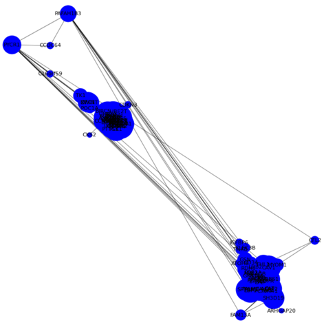

2. სიმსივნური

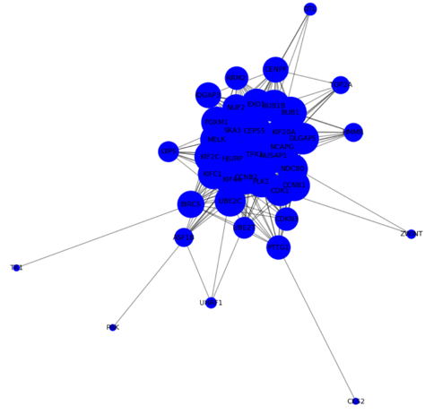

#### Heatmaps

კორელაციის მატრიცების უკეთესი ვიზუალიზაციისთვის ავაგეთ Heatmaps, რომელიც საშუალებას იძლევა სწრაფად და 
მარტივად დავინახოთ, რომელ გენებს შორის არის ძლიერი დადებითი ან უარყოფითი კორელაცია. 
ეს მნიშვნელოვანია გენომიკის კვლევებში, რადგან კორელაციები შეიძლება მიუთითებდნენ ბიოლოგიურ კავშირებს 
ან ფუნქციურ მსგავსებებზე გენებს შორის.

1. ჯანმრთელი

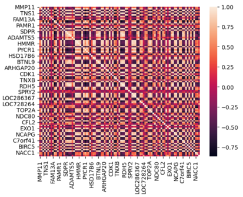

ფერის სქემა მერყეობს -0.75-დან 1.00-მდე, რაც მიუთითებს, რომ ჯანმრთელ უჯრედებში კორელაციების უფრო ფართო დიაპაზონია. 
ეს შეიძლება ნიშნავს, რომ ჯანმრთელ უჯრედებში გენების გამოხატვის ურთიერთობა უფრო მეტად ვარირებს.

2. სიმსივნური

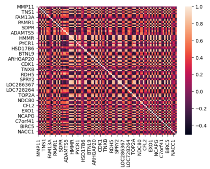

ფერის სქემა მერყეობს -0.4-დან 1.00-მდე, რაც მიუთითებს, რომ სიმსივნურ უჯრედებში კორელაციების დიაპაზონი უფრო ვიწროა. 
ეს შეიძლება მიუთითებდეს, რომ სიმსივნურ უჯრედებში გენების გამოხატვის ურთიერთობები უფრო სტაბილურია ან უფრო ერთგვაროვანი.


## საბოლოო შედეგები
საბოლოოდ, გამოვყავით უნიკალური გენები, რომლებიც მკვეთრად არის ექსპრესირებული სიმსივნურ უჯრედებში.

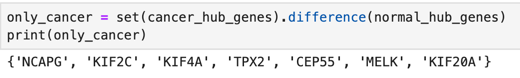

### ლიტერატურა:
მიღებული გენების სიმსივნისთვის პოტენციური ბიომარკერობა განხილულია შემდეგ კველევებში:

ჩვენ ეს გენები მივიღეთ წინასწარი ცოდნის გარეშე, რაც საინტერესო შედეგია

* https://www.sciencedirect.com/science/article/abs/pii/S0006291X18323489
* https://link.springer.com/article/10.1007/s11033-020-05859-9
* https://www.spandidos-publications.com/10.3892/ijo.2020.5060
* https://pubmed.ncbi.nlm.nih.gov/33130993/
* https://journals.sagepub.com/doi/full/10.1177/1533033821992081
* https://www.annalsofoncology.org/article/S0923-7534(20)38891-8/fulltext
* https://www.nature.com/articles/s41392-020-00288-3


